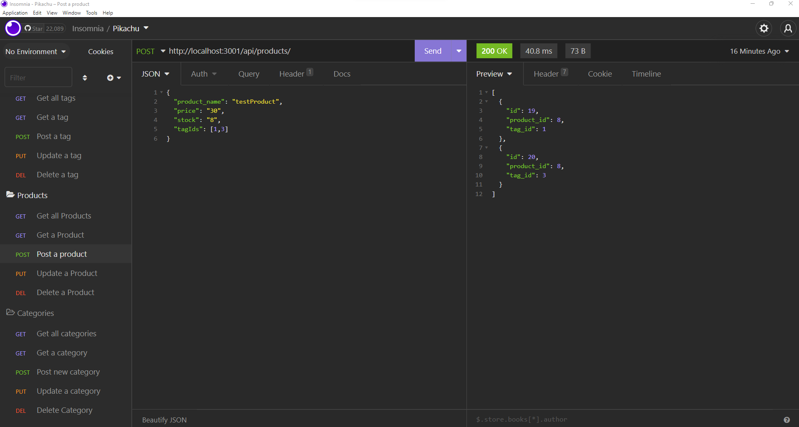

# E-Commerce API

## Table of Contents

- [Description](#description)
- [Installation](#installation)
- [Usage](#usage)
- [Video](#video)
- [Contribution](#contribution)
- [Contact](#contact)

## Description

This is a simple ECommerce CRUD API that users can use to keep track of products. Each product is organized by category and product tag.

## Installation

This program requires Node.js and NPM. Once these are installed, please run:

```
npm init -y
```
and

```
npm i
```

## Usage

The API can be used as a basis for a larger application. It is a CRUD API that you can make GET, POST, PUT, and DELETE requests for the category, product, and tag routes.

## Video

[Link to instructional video](https://huntersteffner.github.io/E-Commerce/)

## Screenshot of Insomnia



## Contribution

You may contact me directly, and then fork the project. Anyone can contribute, but please provide credit to the original work.

## Questions

Feel free to reach out to me directly if you have any questions or concerns. You can reach me via email, or check out my github profile below.

Email: huntersteffner@gmail.com

GitHub: [huntersteffner](https://github.com/huntersteffner/)

## Future developments

Add validation functionality to ensure that input is in the expected format.
